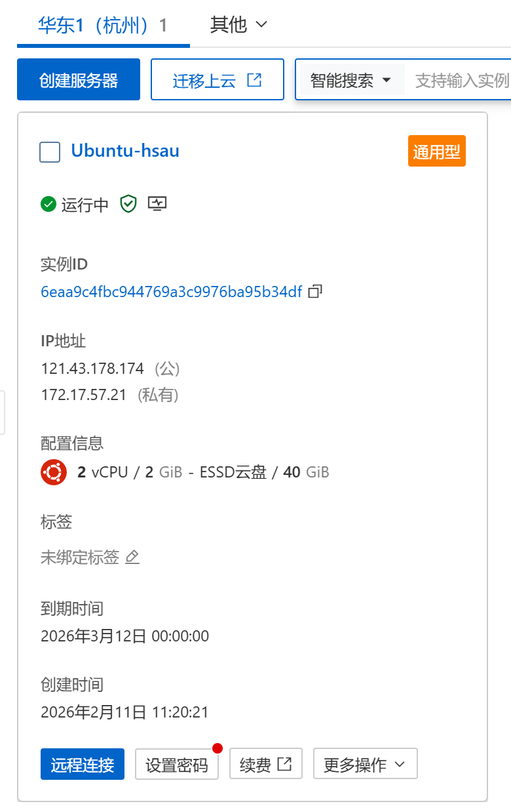
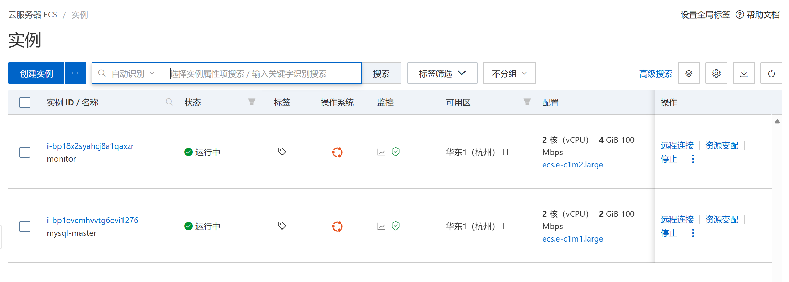
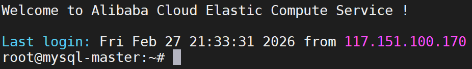
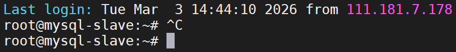
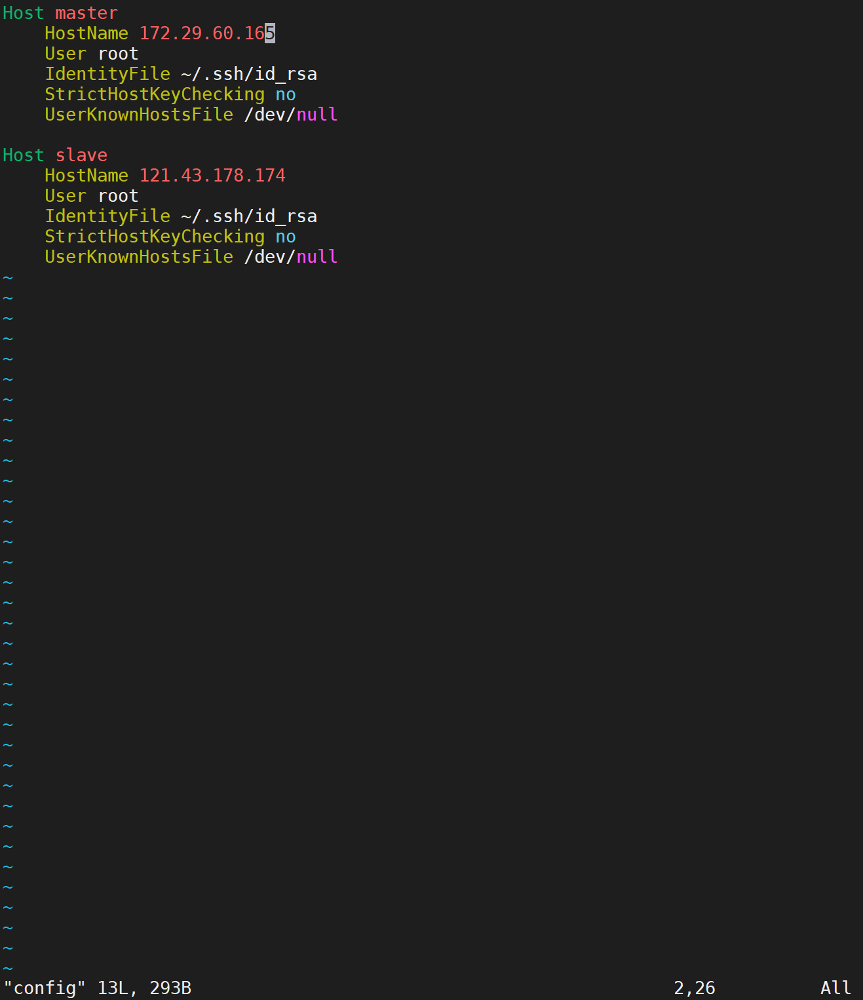
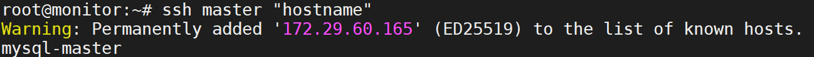
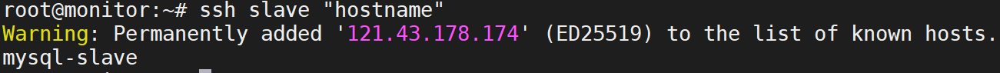
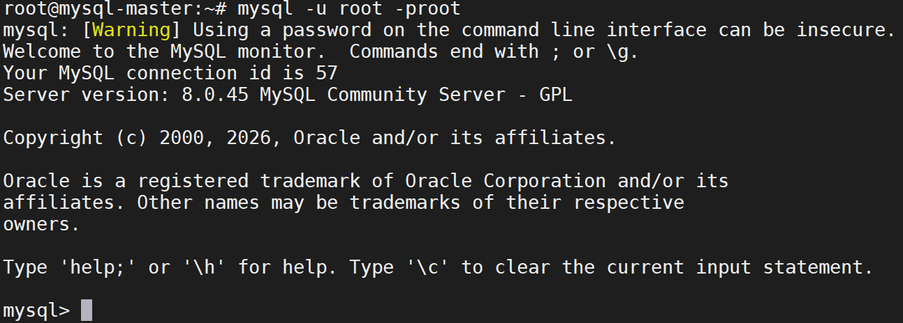
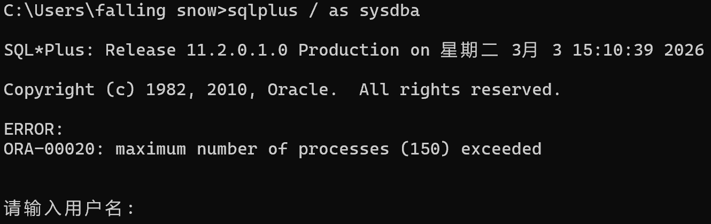
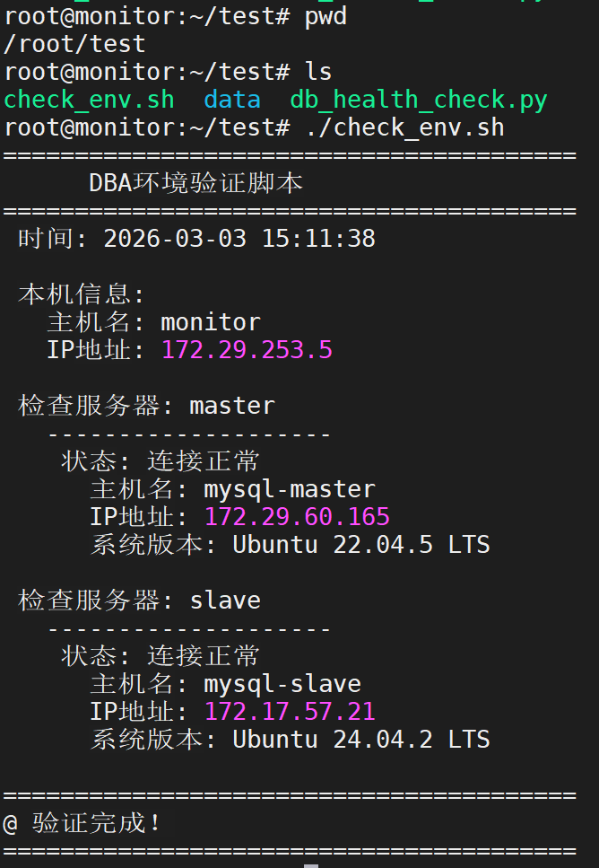

# DBA技能验证项目 · 第一天  
## 环境基础与自动化验证  

**日期**：2026年2月12日  
**作者**：wyq 
**项目仓库**：[DBA-Skills-Portfolio](https://github.com/fallingsnow08/DBA-Portfolio2026_2_11)  

---

## 一、项目概述  

本项目的目标是**通过实战构建一个完整的DBA运维技能体系**，涵盖环境搭建、主从复制、备份恢复、监控告警、性能优化及规范文档等模块。  
第一天作为项目起点，核心任务是**搭建可控的实验环境**，包括：  

- 三台阿里云ECS服务器的基础配置与命名规范  
- 实现监控服务器到数据库服务器的SSH免密登录  
- 验证本地开发机上的Oracle/MySQL可用性  
- 编写自动化环境验证脚本，形成第一个可复用的运维工具  

通过第一天的实践，我不仅掌握了Linux服务器初始化、SSH密钥管理等基础技能，还锻炼了**排查网络连通性问题**的能力，为后续数据库深度运维打下坚实基础。  

---

## 二、实验环境  

### 2.1 服务器清单  

| 角色         | 主机名         | 规格   | 公网IP         | 内网IP        | 操作系统           |
|--------------|----------------|--------|----------------|---------------|--------------------|
| 监控服务器   | `monitor`      | 2核4G  | （已释放）     | 172.29.253.5  | Ubuntu 22.04 LTS   |
| MySQL主库    | `mysql-master` | 2核2G  | 120.26.50.159  | 172.29.60.165 | Ubuntu 22.04 LTS   |
| MySQL从库    | `mysql-slave`  | 2核2G  | 121.43.178.174 | 172.17.57.21  | Ubuntu 24.04 LTS   |

> **说明**：公网IP在实验初期用于SSH配置，后期已切换为内网IP以保证稳定连接且免流量费。

**阿里云实例列表截图**：  
  
  

### 2.2 本地开发机  

- 操作系统：Windows 11 / macOS  
- MySQL客户端：MySQL 8.0 (本地连接正常)  
- Oracle客户端：SQL*Plus (连接本地XE容器正常)  

---

## 三、第一天详细任务记录  

### 3.1 服务器基础配置  

**目标**：统一主机名、更新系统、安装基础工具。  

在每台服务器上依次执行：  

```bash
# 修改主机名（以monitor为例）
sudo hostnamectl set-hostname monitor

# 更新软件源并安装常用工具
sudo apt update && sudo apt upgrade -y
sudo apt install -y vim curl wget net-tools htop tree

# 设置时区
sudo timedatectl set-timezone Asia/Shanghai

# 编辑/etc/hosts，确保127.0.1.1指向正确的主机名
sudo vim /etc/hosts
# 将 127.0.1.1 xxx 改为 127.0.1.1 monitor（或其他对应主机名）
```

**主机名验证截图**：  
- monitor 主机名：  
    
- mysql-master 主机名：  
    
- mysql-slave 主机名：  
    

### 3.2 配置SSH免密登录（监控服务器 → 数据库服务器）  

**目标**：从`monitor`可以无密码SSH登录`mysql-master`和`mysql-slave`，为后续自动化脚本铺路。  

在**monitor**上操作：  

```bash
# 生成RSA密钥对（空密码）
ssh-keygen -t rsa -b 2048 -f ~/.ssh/id_rsa -N ""

# 将公钥复制到两台数据库服务器（首次需输入密码）
ssh-copy-id root@120.26.50.159   # master公网IP
ssh-copy-id root@121.43.178.174  # slave公网IP

# 配置SSH别名（方便后续使用）
cat >> ~/.ssh/config << 'EOF'
Host master
    HostName 172.29.60.165
    User root
    IdentityFile ~/.ssh/id_rsa
    StrictHostKeyChecking no
    UserKnownHostsFile /dev/null

Host slave
    HostName 121.43.178.174
    User root
    IdentityFile ~/.ssh/id_rsa
    StrictHostKeyChecking no
    UserKnownHostsFile /dev/null
EOF

chmod 600 ~/.ssh/config
```

**SSH配置文件内容**：  
  

**验证免密登录**：  

```bash
ssh master "hostname"   # 应返回 mysql-master
ssh slave "hostname"    # 应返回 mysql-slave
```

**测试结果截图**：  
- 到 master 的免密登录：  
    
- 到 slave 的免密登录：  
    

> **注意**：首次连接会出现警告 `Warning: Permanently added ...`，这是SSH记录主机指纹的正常现象，后续连接不再提示。  

### 3.3 本地数据库连通性验证  

**目标**：确保本地开发环境中的MySQL和Oracle可正常连接，用于后续对比测试。  

**MySQL验证**：  

```bash
mysql -u root -p
# 输入密码后执行：
SELECT VERSION();
SHOW DATABASES;
# 创建远程测试用户（可选）
CREATE USER 'remote_dba'@'%' IDENTIFIED BY 'your_password';
GRANT ALL PRIVILEGES ON *.* TO 'remote_dba'@'%';
FLUSH PRIVILEGES;
```

**MySQL连接成功截图**：  
  

**Oracle验证**（以XE容器为例）：  

```bash
sqlplus / as sysdba
# 执行：
SELECT * FROM dual;
```

但实验过程中遇到了Oracle进程数超限的问题：  
  

该问题将在后续步骤中解决，此处作为环境验证的原始记录。  

### 3.4 编写自动化环境验证脚本  

**目标**：将手动检查过程脚本化，实现一键获取所有服务器状态。  

脚本路径：`/root/check_env.sh`  

```bash
#!/bin/bash
# DBA环境验证脚本
# 功能：检查监控服务器到MySQL主从的连通性及系统信息
# 用法：./check_env.sh

echo "========================================"
echo "      DBA环境验证脚本"
echo "========================================"
echo "时间: $(date '+%Y-%m-%d %H:%M:%S')"
echo ""

# 1. 本机信息
echo "本机信息:"
echo "  主机名: $(hostname)"
echo "  IP地址: $(hostname -I | awk '{print $1}')"
echo ""

# 2. 定义服务器列表
servers="master slave"

# 3. 循环检查
for server in $servers; do
    echo "检查服务器: $server"
    echo "--------------------"
    
    # 测试SSH连接（3秒超时，静默模式）
    if ssh -o ConnectTimeout=3 $server "echo OK" &>/dev/null; then
        # 获取远程信息
        remote_hostname=$(ssh $server hostname 2>/dev/null)
        remote_ip=$(ssh $server "hostname -I | awk '{print \$1}'" 2>/dev/null)
        remote_os=$(ssh $server "cat /etc/os-release | grep PRETTY_NAME | cut -d= -f2 | tr -d '\"'" 2>/dev/null)
        
        echo "  ✅ 状态: 连接正常"
        echo "     主机名: $remote_hostname"
        echo "     IP地址: $remote_ip"
        echo "     系统版本: $remote_os"
    else
        echo "  ❌ 状态: 连接失败"
        echo "     请检查:"
        echo "     - SSH服务是否运行"
        echo "     - 网络是否通畅"
        echo "     - 防火墙规则"
    fi
    echo ""
done

echo "========================================"
echo "✅ 验证完成！"
echo "========================================"
```

赋予执行权限并运行：  

```bash
chmod +x /root/check_env.sh
/root/check_env.sh
```

**脚本执行成功截图**：  
  

---

## 四、关键技术点解析  

| 技术点 | 命令/配置示例 | 说明 |
|--------|--------------|------|
| 永久修改主机名 | `hostnamectl set-hostname` | 统一标识，避免使用默认实例名 |
| SSH密钥认证 | `ssh-keygen` + `ssh-copy-id` | 实现免密登录，自动化基础 |
| SSH客户端配置 | `~/.ssh/config` | 简化登录命令，支持别名和超时控制 |
| 远程命令执行 | `ssh $host "command"` | 获取远程服务器信息 |
| 命令超时控制 | `-o ConnectTimeout=3` | 防止脚本因网络问题卡死 |
| 静默执行 | `&>/dev/null` | 只关心命令返回值，不关心输出 |
| 文本处理 | `awk '{print $1}'` | 提取IP列表中的第一个地址 |
| 多行输入创建文件 | `cat > file << 'EOF'` | 无需编辑器，直接写入脚本 |

---

## 五、遇到的问题与解决方案  

### 问题1：内网IP之间无法Ping通  

**现象**：从`monitor` ping `mysql-slave`的内网IP（172.17.57.21）失败，返回 `Destination Host Unreachable`。  

**原因**：三台ECS可能不在同一VPC，或安全组未开放内网ICMP/全部流量。  

**解决方案**：  
- **临时绕过**：使用公网IP完成SSH免密配置，保证功能可用。  
- **长期优化**：后续在阿里云控制台调整VPC和安全组，确保内网互通（本实验后期已切换为私网IP，证明内网最终是通的，可能是之前安全组规则未生效）。  

### 问题2：首次使用`ssh master`出现警告信息  

**现象**：  
```
Warning: Permanently added '172.29.60.165' (ED25519) to the list of known hosts.
```  

**原因**：SSH首次连接时会记录远程主机指纹，是正常的安全机制。  

**解决方案**：  
在`~/.ssh/config`中添加以下配置，后续连接不再提示：  
```
StrictHostKeyChecking no
UserKnownHostsFile /dev/null
```  

### 问题3：公网IP变更导致连接失败（关键问题）  

**现象**：时隔多日再次运行`check_env.sh`，发现`master`连接失败，而`slave`正常。经排查，原因为`master`的公网IP已变化（阿里云实例重启后公网IP可能变化，若未使用弹性IP）。  

**排查过程**：  
1. 尝试直接`ssh root@120.26.50.159`，卡住无响应。  
2. 通过阿里云控制台查看实例，发现公网IP已变更为新地址。  
3. 但私网IP `172.29.60.165` 保持不变，且`monitor`与`master`在同一VPC，私网应该互通。  
4. 修改`~/.ssh/config`中`master`的`HostName`为私网IP，再次测试成功。  

**解决方案**：  
- **立即修复**：将所有数据库服务器的SSH配置改为**私网IP**，避免依赖公网IP的稳定性。  
- **长期策略**：在云环境中，应优先使用私网IP进行内部通信，既稳定又免费；公网IP仅用于外部访问或管理，若需固定公网IP可申请弹性公网IP。  

### 问题4：Oracle连接时进程数超限  

**现象**：本地Oracle连接时出现 `ORA-00020: maximum number of processes (150) exceeded`。  

**原因**：本地Oracle容器或实例的进程数达到上限。  

**解决方案**：  
（此处可根据实际解决情况补充，例如重启数据库或调整参数；若未解决可作为遗留问题记录。）  

---

## 六、产出物清单  

| 类型 | 名称 | 说明 |
|------|------|------|
| 脚本 | `check_env.sh` | 自动化环境验证脚本，可一键检查三台服务器状态 |
| 截图集 | `/images/day1/` | 包含服务器列表、SSH测试、数据库连接、脚本运行结果等9张截图 |
| 文档 | `day1_summary.md` | 本日详细总结（即本文档） |
| 配置文件 | `~/.ssh/config` | SSH客户端配置，实现别名登录 |
| 服务器信息表 | `server_info.md` | 记录各服务器IP、角色、配置 |

---

## 七、反思与下一步计划  

### 7.1 今日收获  

- 掌握了Linux服务器初始化、主机名修改、SSH密钥认证等基础运维技能。  
- 学会了编写实用的Shell脚本，并应用了超时控制、静默执行、远程命令等技巧。  
- 锻炼了问题排查能力：从公网IP失效到切换私网IP的完整过程。  
- 建立了“自动化优先”的意识，手动检查转为脚本化，为后续监控和巡检打下基础。  

### 7.2 改进方向  

- **网络规划**：初期应明确所有服务器在同一VPC并配置好安全组，避免依赖公网IP。  
- **配置管理**：将SSH配置、脚本等纳入版本控制（如Git），方便迁移和回溯。  
- **文档习惯**：及时记录操作过程和问题，形成可复用的知识库。  

### 7.3 第二天计划  

- 在`mysql-master`和`mysql-slave`上安装MySQL 8.0。  
- 配置基于GTID的主从复制。  
- 验证数据同步，并撰写《MySQL主从搭建指南》。  

---

## 附录：脚本源码  

<details>  
<summary>点击展开 check_env.sh 完整代码</summary>  

```bash
#!/bin/bash
# DBA环境验证脚本
# 功能：检查监控服务器到MySQL主从的连通性及系统信息
# 用法：./check_env.sh

echo "========================================"
echo "      DBA环境验证脚本"
echo "========================================"
echo "时间: $(date '+%Y-%m-%d %H:%M:%S')"
echo ""

# 1. 本机信息
echo "本机信息:"
echo "  主机名: $(hostname)"
echo "  IP地址: $(hostname -I | awk '{print $1}')"
echo ""

# 2. 定义服务器列表
servers="master slave"

# 3. 循环检查
for server in $servers; do
    echo "检查服务器: $server"
    echo "--------------------"
    
    # 测试SSH连接（3秒超时，静默模式）
    if ssh -o ConnectTimeout=3 $server "echo OK" &>/dev/null; then
        # 获取远程信息
        remote_hostname=$(ssh $server hostname 2>/dev/null)
        remote_ip=$(ssh $server "hostname -I | awk '{print \$1}'" 2>/dev/null)
        remote_os=$(ssh $server "cat /etc/os-release | grep PRETTY_NAME | cut -d= -f2 | tr -d '\"'" 2>/dev/null)
        
        echo "  ✅ 状态: 连接正常"
        echo "     主机名: $remote_hostname"
        echo "     IP地址: $remote_ip"
        echo "     系统版本: $remote_os"
    else
        echo "  ❌ 状态: 连接失败"
        echo "     请检查:"
        echo "     - SSH服务是否运行"
        echo "     - 网络是否通畅"
        echo "     - 防火墙规则"
    fi
    echo ""
done

echo "========================================"
echo "✅ 验证完成！"
echo "========================================"
```  

</details>  

---

> **声明**：本文档基于实际实验过程撰写，所有截图均为真实环境所得。  
> 欢迎Star和Fork本项目，一起交流DBA实战技能！

---
